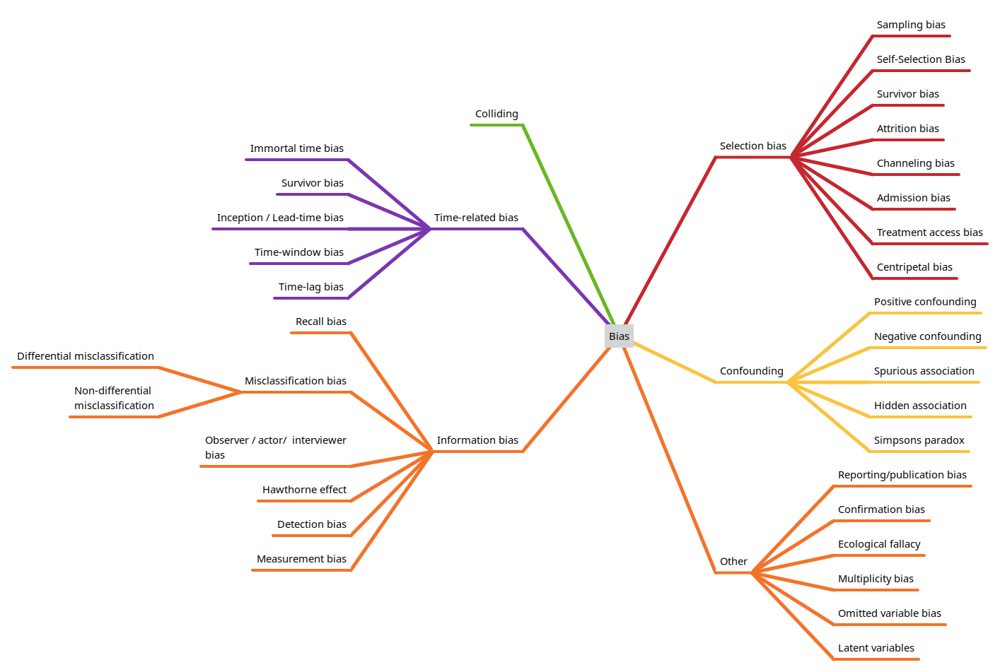

# Types of bias in observational studies

Below are types of bias that occur in studies, grouped by broad classifications (some biases may straddle general categories, but are placed in just one category here to avoid duplication).

## Selection bias

Selection bias occurs when the study sample is not representative of the target population, leading to skewed results. This may be due to various types of types:

* **Sampling Bias**: When certain members of the intended population are less likely to be included than others.

* **Self-Selection Bias**: Occurs when individuals volunteer to participate in studies, potentially differing significantly from those who don't participate. For example, people who respond to health surveys may be more health-conscious than the general population.

* **Survivor Bias**: Happens when only successful cases or "survivors" of a process are studied, ignoring those who didn't make it through.

* **Attrition Bias**: Arises when participants who drop out of a study differ systematically from those who remain.

* **Channeling Bias**: Patients are assigned to different groups based on characteristics like age or severity of illness, creating imbalances between cohorts.

* **Admission (Berkson) Bias**: Arises when hospitalized patients are compared to non-hospitalized ones, as the former group tends to be sicker and less representative.

* **Treatment Access Bias**: Happens when subjects have decreased access to healthcare due to cultural or socioeconomic factors.

* **Centripetal Bias**: Occurs when a clinician's or clinic's reputation attracts patients not representative of the general population.

## Information bias

Information bias occurs due to errors in measuring or recording exposure, outcome, or other variables.

* **Recall Bias**: Participants may remember past exposures differently based on their disease status (e.g., cases recalling exposures more vividly than controls).

* **Misclassification Bias**: Errors in categorizing participants into exposure or outcome groups: *Differential Misclassification*: Errors differ between study groups, leading to over-estimation or under-estimation of effect size. *Non-Differential Misclassification*: Errors occur equally across groups but dilute associations.

* **Hawthorne Effect**: Participants alter their behaviour simply because they are being observed. This can include *Social desirability bias*, when respondents answer questions in a way they believe will be viewed favourably by others, such as over-reporting positive behaviours or under-reporting negative ones. Participants may also change behaviour or reporting if they know which study group they have been assigned to.

* **Observer bias (Actor-observer bias)**: Occurs when the investigator's prior knowledge or beliefs of the hypothesis or participant status influences how information is collected or interpreted.  Includes *interviewer bias* when an interviewer asks leading questions that systematically influence responses. There may also be *Observer drift* when observers become less careful in taking measurements over time.

* **Measurement bias**: Stems from systematic errors in data collection, inconsistent measurement methods, or poorly calibrated instruments.

* **Detection bias**: occurs when outcome information is collected differently between groups.

# Confounding

Confounding occurs when an extraneous variable influences both the exposure and outcome, creating a false association.

* **Positive Confounding**: occurs when the confounder enhances or overestimates a true association between the exposure and outcome.

* **Negative Confounding**: occurs when the confounder reduces or underestimates a true association between the exposure and outcome.

* **Spurious Association**: creates an apparent association between variables when no real association exists. See *colliding* below.

* **Hidden Association**: results in an apparent absence of association despite a real relationship existing between variables.

* **Simpson's Paradox**: A trend or association that appears in several groups of data but disappears or reverses when the groups are combined. This occurs when there is a lurking or confounding variable that affects the relationship between two variables.

# Colliding

A collider is a variable that is causally influenced by two or more other variables, where the causal arrows appear to "collide" at the node in directed acyclic graphs (DAGs). When researchers condition on (control for, adjust for, or restrict analysis based on) a collider, it can create spurious associations between the variables that influence it.  An example of colliding is the the obesity paradox: where obesity appears protective in diabetes patients because diabetes status is a collider between obesity and mortality.

# Time-Related Bias

Time-related biases arise from improper handling of time in study design.

* **Immortal Time Bias**: Misclassifies a period during which participants cannot experience the outcome as part of the follow-up time for one group, artificially inflating its survival. This bias is created when patients must survive sufficiently long to receive treatment, making them effectively "immortal" during that period.

* **Survivor Bias**: Excludes individuals who did not survive long enough to be included in the study cohort.

* **Inception/Lead-Time Bias**: Occurs when patients already receiving an intervention are included in analyses, excluding those who experienced outcomes early after treatment starts. Or it may arise when earlier detection of a condition (e.g., through screening) inaccurately appears to increase survival time, even if natural disease progression is unchanged.

* **Time window bias**: Affects studies when the time window for defining exposure differs between comparison groups.

* **Time-Lag Bias**: Appears when comparing first-line treatments with second or third-line treatments without accounting for disease duration or prior medication use.

# Other

* **Reporting or publication bias**: Published studies may be biased towards those that showed significant or positive findings.

* **Ecological fallacy**: An Ecological fallacy occurs when conclusions about individuals are drawn from analyses of group (aggregate) data. An example is Robinson's Paradox where, in the 1950s, a study found that states with higher proportions of foreign-born residents had lower literacy rates. However, when examining specific groups within states, this relationship disappeared.

* **Confirmation bias**: Confirmation bias reflects the tendency to seek or interpret information that supports pre-existing beliefs, ignoring contradictory evidence.

* **Multiplicity bias (Multiple comparisons problem)**: Multiplicity bias, also known as the multiple comparisons problem, occurs when multiple statistical tests are performed simultaneously, leading to an increased risk of false positive results (Type I errors). This happens because each additional statistical test increases the likelihood of finding a significant result purely by chance.

* **Omitted variable bias**: is a statistical error that occurs when a regression model fails to include one or more relevant variables that influence both the dependent and independent variables.

